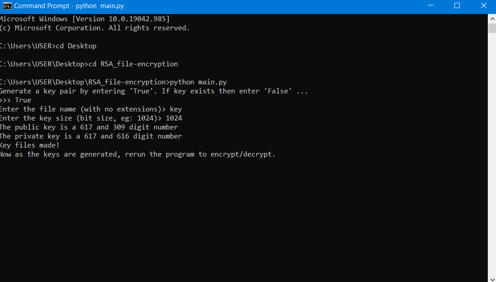
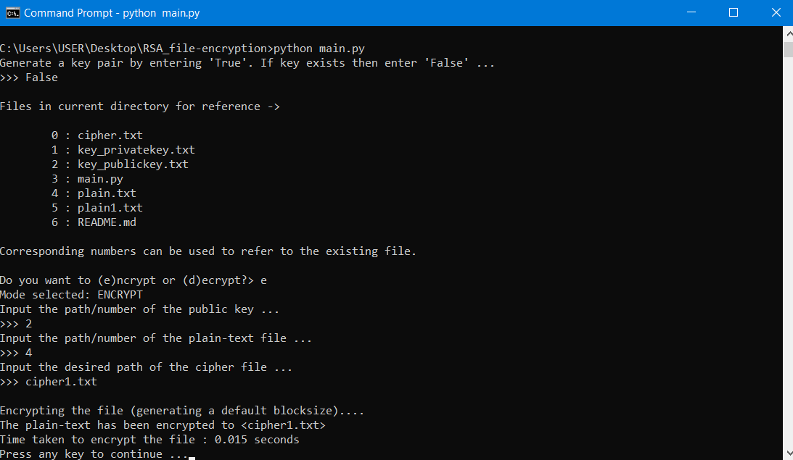
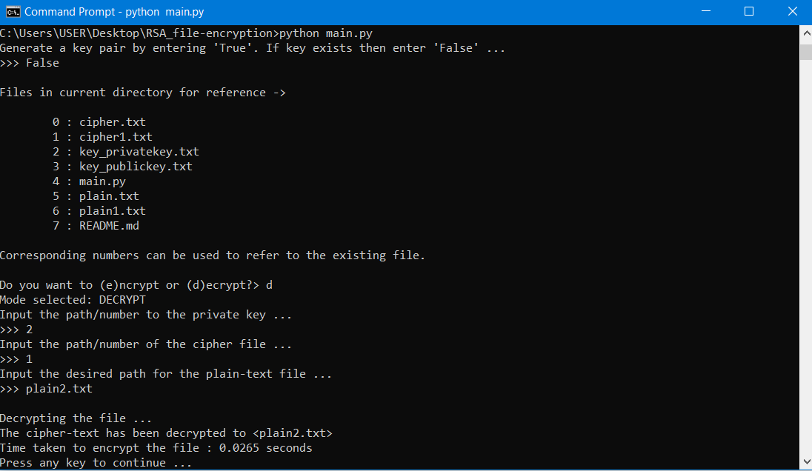

# RSA_file_encryption
Implemention Of RSA ALGORITHM to encrypt/decrypt text file.

# Description 
RSA (Rivest–Shamir–Adleman) is an algorithm used by modern computers to encrypt and decrypt messages. It is an asymmetric cryptographic algorithm. Asymmetric means that there are two different keys. This is also called public key cryptography, because one of the keys can be given to anyone.
Imagine that someone on the other side of the world wants to communicate with you. You both know that spy agencies are monitoring all emails, letters, texts, and phone calls. To send encrypted messages to that person, you both must agree on a secret key to use. But if one of you emails the secret key to the other, the spy agency will intercept this key and then decrypt any future messages encrypted using that key. Secretly meeting in person to exchange the key is impossible. You can try encrypting the key, but this requires sending that secret key for that message to the other person, which will also be intercepted.
Public key cryptography solves this encryption problem by using two keys, one for encryption and one for decryption, and is an example of an asymmetric cipher. Ciphers that use the same key for encryption and decryption are symmetric ciphers. It’s important to know that a message encrypted using the encryption key (public key) can only be decrypted using the decryption key (private key). So even if someone obtains the encryption key, they won’t be able to read the original message because the encryption key can’t decrypt the message.
The encryption key is called the public key because it can be shared with the entire world. In contrast, the private key, or the decryption key, must be kept secret.

# How to use
Note- You do not have to download any modules prior to running this program as they used are already included in the source code.

Open cmd and change directory to the project folder and then follow the steps as shown below

